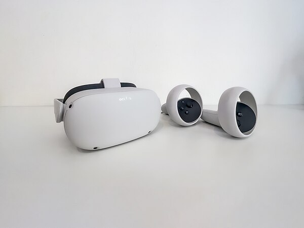
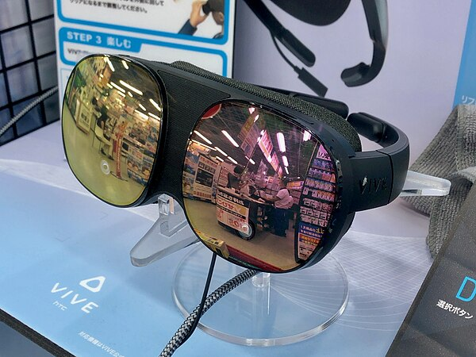
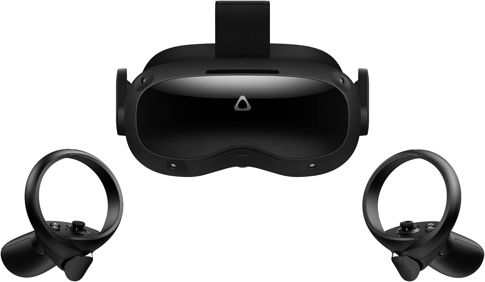
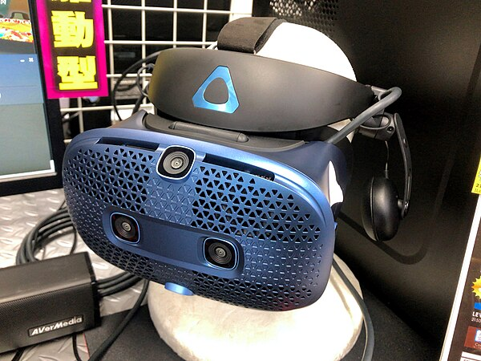
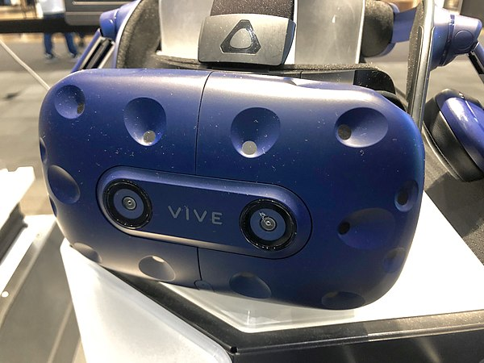
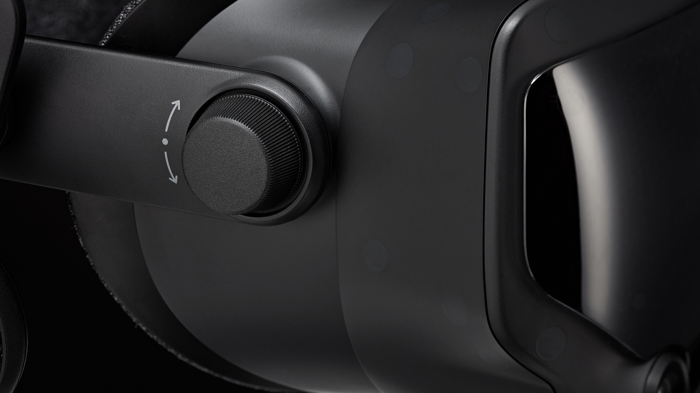
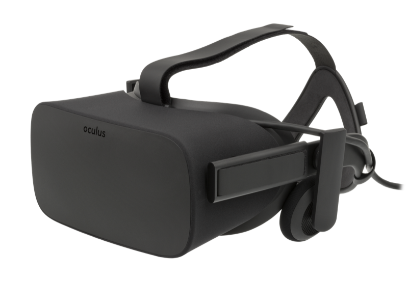
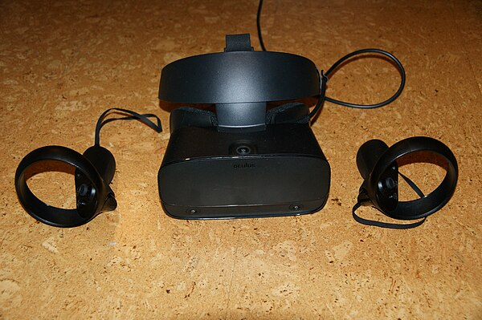

---
tags:
  - Equipment
  - VR
  - Keralia Training
date: 2026-03-30
version: "4.0"
---

# VR Headsets

  Last Updated: 03-30-2026 &middot; v4.0
  Equipment
  VR
  Keralia Training

Virtual reality headsets available in the XRIML. Items marked with :material-cart-outline: can be checked out via [WebCheckout](../policies/equipment-checkout.md).

| Icon | Meaning |
|------|---------|
| :material-cart-outline: | Available for checkout via WebCheckout |
| :material-access-point: | Standalone VR (no PC required) |
| :material-link-variant: | Wired VR (PC-tethered) |

---

## Standalone Headsets

### Meta Quest 2 :material-cart-outline: :material-access-point:

{ width="300", loading=lazy }

Wireless VR platform with vast content access and optional PC tethering for greater flexibility.

---

### HTC Vive Flow :material-access-point:

{ width="300", loading=lazy }

Ultra-lightweight VR glasses built for comfortable on-the-go and casual immersive content use.

---

### HTC Vive Focus 3 :material-cart-outline: :material-access-point:

{ width="300", loading=lazy }

Enterprise-focused standalone VR headset delivering rich visuals and business-grade efficiency.

---

### Pico Neo 3 Pro Eye :material-cart-outline: :material-access-point:

Eye-tracking capable standalone VR headset tailored for enterprise workflows and analytics.

---

## PC-Tethered Headsets

### HTC Vive Cosmos :material-link-variant:

{ width="300", loading=lazy }

Features inside-out tracking offering high-resolution visuals and user convenience in one headset.

---

### HTC Vive Pro :material-link-variant:

{ width="300", loading=lazy }

A professional-grade VR headset with superior ergonomics, refined audio, and enhanced visual clarity for extended sessions.

---

### HTC Vive Pro 2 :material-cart-outline: :material-link-variant:

{ width="300", loading=lazy }

A 5K-resolution headset offering an expansive field of view and smooth performance — designed for hyper-realistic VR applications.

---

### HTC Vive Pro Eye :material-cart-outline: :material-link-variant:

{ width="300", loading=lazy }

Adds integrated eye-tracking to the Pro headset platform for gaze-based interaction and advanced research analytics.

---

### Valve Index :material-cart-outline: :material-link-variant:

{ width="300", loading=lazy }

High-fidelity VR system known for its wide field of view, rich visuals, and precision motion controls.

---

### Meta Oculus Rift :material-cart-outline: :material-link-variant:

{ width="300", loading=lazy }

PC VR classic offering external sensor tracking and access to foundational immersive content.

---

### Oculus Rift S :material-cart-outline: :material-link-variant:

{ width="300", loading=lazy }

Refined PC VR headset with improved comfort and inside-out tracking for a tech-updated Rift experience.

---

!!! tip "Which headset should I use?"
    For most coursework and projects, the **Meta Quest 2** is recommended — it's standalone, portable, and supports optional PC tethering. For high-fidelity PC rendering, use the **HTC Vive Pro 2** or **Valve Index** at a lab workstation. For eye-tracking research, consider the **HTC Vive Pro Eye** or **Pico Neo 3 Pro Eye**.
